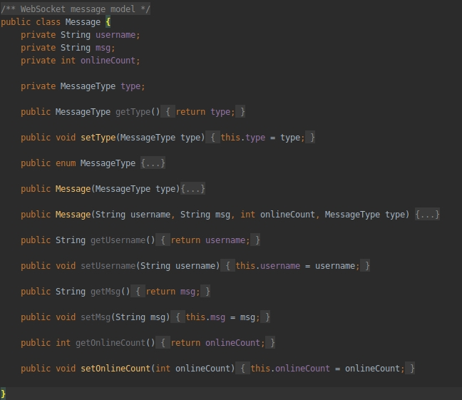
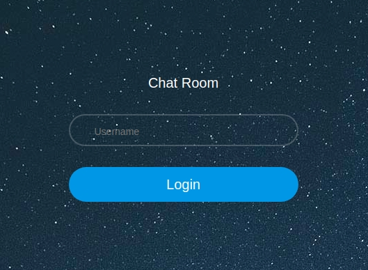
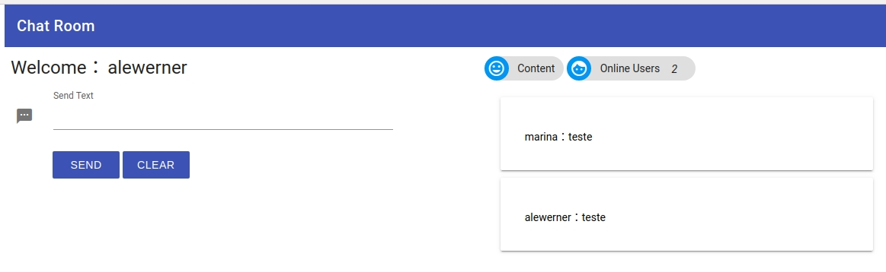

# Chat Room
Complete the chat room application implementation using WebSocket.

## Background
WebSocket is a communication protocol that makes it possible to establish a two-way communication channel between a
server and a client.

## Instruction
### Implement the message model
Message model is the message payload that will be exchanged between the client and the server. Implement the Message
class in chat module. Make sure you cover all there basic actions.
1. ENTER
2. CHAT
3. LEAVE

### Complete WebSocketChatServer
Implement all TODOs inside WebSocketChatServer follow each method description.

### Run the application with command
mvn build; mvn spring-boot:run

### Tests:

#### Selenium Framework and Junit 

#### Web Driver for Selenium:
To help with the configuration of the WebDriver, for tests, I used this lib: 
[WebDriverManager](https://github.com/bonigarcia/webdrivermanager/)

#### PrintScreens:
Login:

ChatRoom:

### Reference Material:
* [Selenium Assertions](https://www.lambdatest.com/blog/junit-assertions-example-for-selenium-testing/)
* [Spring Boot Testing](https://stackoverflow.com/questions/51789880/how-to-test-a-component-bean-in-spring-boot)
* [Selenium and SpringBoot](https://stackoverflow.com/questions/54599169/how-to-configure-selenium-webdriver-with-spring-boot-for-ui-testing)
* [Git Ignore Generator](https://www.gitignore.io/)
* [GitHub Markdown Reference](https://guides.github.com/features/mastering-markdown/)
